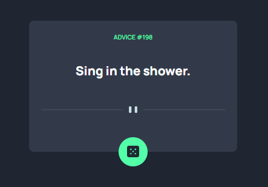

# Gerador de Conselhos

## 📋 Índice
- [Descrição](#-descrição)
- [Funcionalidades](#-funcionalidades)
- [Tecnologias Utilizadas](#-tecnologias-utilizadas)
- [Instalação](#-instalação)
- [Como Usar](#-como-usar)
- [Captura de Tela](#-captura-de-tela)
- [Links](#-links)
- [Autor](#-autor)
- [Licença](#-licença)

## 📝 Descrição
Aplicação web que gera conselhos aleatórios através de uma API, criada como desafio do Frontend Mentor.

## ✨ Funcionalidades
- Gera conselhos aleatórios ao clicar no botão
- Interface simples e minimalista
- Carregamento automático de conselho inicial
- Integração com API externa

## 🚀 Tecnologias Utilizadas
- HTML5
- CSS3
- JavaScript (ES6+)
- API de Conselhos: Advice Slip

## 🔧 Instalação
1. Clone o repositório
2. Abra o arquivo `index.html` em seu navegador
3. Sem necessidade de instalação de dependências

## 🌟 Como Usar
- Clique no botão de dado para gerar um novo conselho
- O número do conselho e sua mensagem serão atualizados automaticamente

## 📸 Captura de Tela

## 🔗 Links
- [Desafio no Frontend Mentor](https://www.frontendmentor.io)
- [Repositório no GitHub](https://github.com/Andrekrykhtine?tab=repositories)

## 👤 Autor
Andre Krykhtine

## 📃 Licença
Este projeto está sob licença MIT

## 🙏 Agradecimentos
Agradeço à comunidade de desenvolvedores, à plataforma Frontend Mentor por proporcionar desafios inspiradores, e a todos que contribuem para o crescimento contínuo no mundo do desenvolvimento web.